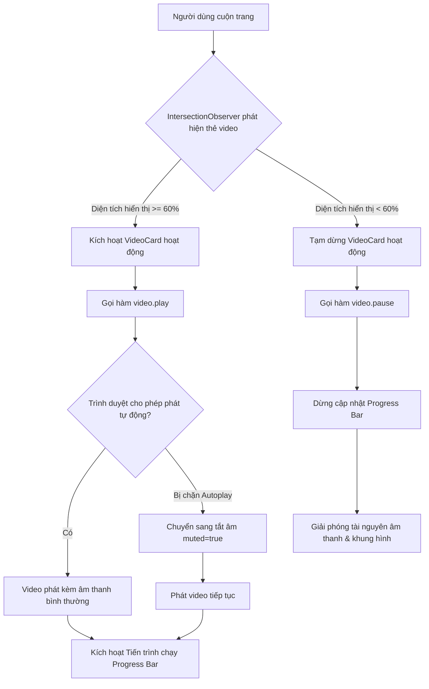
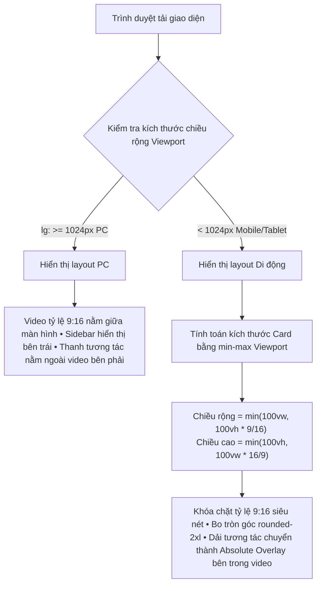

This is a [Next.js](https://nextjs.org) project bootstrapped with [`create-next-app`](https://nextjs.org/docs/app/api-reference/cli/create-next-app).

## Getting Started

First, run the development server:

```bash
npm run dev
# or
yarn dev
# or
pnpm dev
# or
bun dev
```

Open [http://localhost:3000](http://localhost:3000) with your browser to see the result.

You can start editing the page by modifying `app/page.tsx`. The page auto-updates as you edit the file.

This project uses [`next/font`](https://nextjs.org/docs/app/building-your-application/optimizing/fonts) to automatically optimize and load [Geist](https://vercel.com/font), a new font family for Vercel.

---

## 🛠️ Luồng Xử Lý & Luồng Hoạt Động Của Hệ Thống (System Architecture & Flows)

Dưới đây là chi tiết luồng xử lý kỹ thuật và luồng hoạt động tương tác trong ứng dụng TikTok Clone để đảm bảo hiệu năng tối đa và trải nghiệm người dùng hoàn hảo:

### 1. Luồng Hoạt Động Khi Cuộn Trang (Scroll & Lifecycle Flow)

Quy trình tự động kích hoạt/tạm dừng video khi người dùng thực hiện thao tác cuộn màn hình:



*   **Tối ưu hóa**: Đảm bảo **chỉ duy nhất 1 video** được hoạt động và phát nhạc tại một thời điểm, tránh gây xung đột âm thanh và quá tải CPU.

---

### 2. Luồng Xử Lý Tương Tác Người Dùng (User Interaction Processing Flow)

Quy trình tiếp nhận và xử lý các sự kiện tương tác trực tiếp trên giao diện:

#### A. Nhấp chuột vào màn hình video (Toggle Play/Pause)
1. Người dùng click/tap vào khu vực video.
2. Hệ thống kiểm tra trạng thái:
   * Nếu đang chạy -> Gọi `video.pause()` và hiển thị biểu tượng **Pause (Tạm dừng)** nhấp nháy ở trung tâm.
   * Nếu đang dừng -> Gọi `video.play()` và hiển thị biểu tượng **Play (Phát)** nhấp nháy ở trung tâm.
3. Kích hoạt hiệu ứng chuyển động mượt mà (Micro-animation) tự động biến mất sau `600ms`.

#### B. Nhấn nút Thích / Tym (Like Event Flow)
1. Người dùng nhấn nút Heart (Tym) ở thanh tương tác bên phải.
2. Trình kích hoạt gọi sự kiện `onToggleLike(videoId)`.
3. State của tương tác trong `VideoFeed` được cập nhật (Tăng/giảm số Tym và chuyển trạng thái `isLiked` từ `true` $\leftrightarrow$ `false`).
4. Nút Tym trên giao diện kích hoạt hiệu ứng zoom-pop (`animate-like-pop`) nổi bật và đổi sang màu hồng đặc trưng của TikTok.

#### C. Bật/Tắt âm thanh (Mute/Unmute Flow)
1. Người dùng nhấn nút biểu tượng loa (ở góc trên bên phải video).
2. Sự kiện `toggleMute(e)` được gọi, chặn lan truyền sự kiện click cha (`e.stopPropagation()`).
3. Chuyển đổi trạng thái `video.muted = !video.muted` và cập nhật biểu tượng loa tương ứng ngay lập tức.

---

### 3. Luồng Co Giãn Kích Thước Tự Động (Responsive Sizing Flow)

Quy trình tự động đo đạc và điều chỉnh tỷ lệ khung hình video để chống tràn trên mọi thiết bị:



---

### 4. Hướng dẫn xử lý logic Play/Pause khi cuộn trang (Auto-Play/Pause on Scroll)

Ứng dụng sử dụng API hiệu năng cao **`IntersectionObserver`** tích hợp trong React hook `useEffect` của mỗi `VideoCard` để tự động điều khiển trạng thái phát video khi người dùng cuộn trang:

*   **Theo dõi tỷ lệ hiển thị**: Chỉ phát video khi đạt tỷ lệ hiển thị **>= 60%** trong khung hình.
*   **Dọn dẹp bộ nhớ**: Khi component bị hủy (`unmount`), trình quan sát tự động ngắt kết nối (`observer.disconnect()`), ngăn ngừa triệt để rò rỉ bộ nhớ (memory leaks).

---

## Learn More

To learn more about Next.js, take a look at the following resources:

- [Next.js Documentation](https://nextjs.org) - learn about Next.js features and API.
- [Learn Next.js](https://nextjs.org/learn) - an interactive Next.js tutorial.

You can check out [the Next.js GitHub repository](https://github.com/vercel/next.js) - your feedback and contributions are welcome!

## Deploy on Vercel

The easiest way to deploy your Next.js app is to use the [Vercel Platform](https://vercel.com/new?utm_medium=default-template&filter=next.js&utm_source=create-next-app&utm_campaign=create-next-app-readme) from the creators of Next.js.

Check out our [Next.js deployment documentation](https://nextjs.org/docs/app/building-your-application/deploying) for more details.
